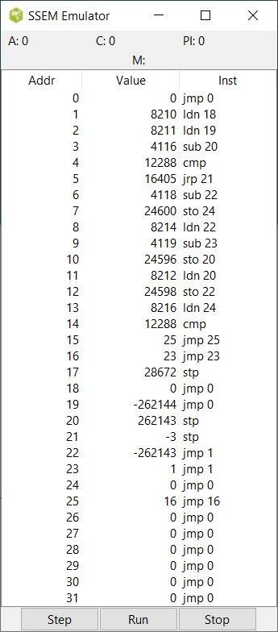

# SSEM

A Manchester Small-Scale Experimental Machine (SSEM) Emulator.

The SSEM was the first stored-program computer. A description of the
machine can be found in its Wikipedia entry:

  http://en.wikipedia.org/wiki/Manchester_Small-Scale_Experimental_Machine


## LICENSE

See the LICENSE file.

## USAGE

From a Tk console open the application by:

```
cd "the/src/directory"
source ssemgui.tcl
```



The GUI is divided in two sections.

The first section shows the contents of the registers and the memory:

* **A** Accumulator
* **C** Program Counter
* **PI** Current Instruction
* **M** Memory
  * **Addr** The address of the memory cell
  * **Value** The contents of the memory cell
  * **Inst** The contents of the memory cell interpreted as a instruction

The second section contains the buttons that control the emulator: 

* **Step** Execute the current instruction and stop
* **Run** Run the program until a stop instruction is executed
* **Stop** Stop a running program

The memory is initialized with the first program written for the SSEM,
which computes the highest proper factor of 2^18. Just click 'Run' and see it working.


